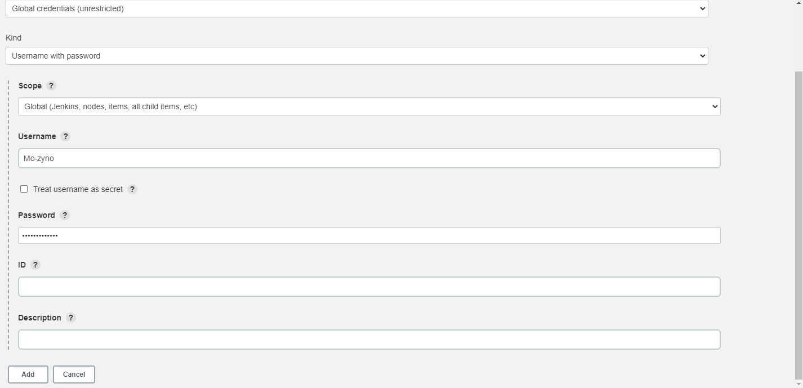

# TOOLING WEBSITE DEPLOYMENT AUTOMATION WITH CONTINUOUS INTEGRATION. INTRODUCTION TO JENKINS

**This is a continuation of the previous Project , where we deployed a load balancer (Horizontal Scaling) where we added new Web Servers to the Tooling Webite and used the load balancer to distribute traffic between them. In this Project, We are going to start automation of the routine tasks using open source automation server - Jenkins. When done, our updated architecture will look like this:**

**Jenkins is one of the most popular CI/CD tools, according to Circle CI, Continuous integration (CI) is a software development strategy that increases the speed of development while ensuring the quality of the code that teams deploy. Developers continually commit code in small increments (at least daily, or even several times a day), which is then automatically built and tested before it is merged with the shared repository.**

*In our project we are going to utilize Jenkins CI capabilities to make sure that every change made to the source code in GitHub https://github.com/<yourname>/tooling will be automatically be updated to the Tooling Website.*

[project image](./images/project%20image.png)

## LET'S GET STARTED

# INSTALLED AND CONFIGURE JENKINS SERVER

## STEP 1 -Installed Jenkins Serve

1. Launched and AWS EC2 Instance based on Ubuntu O.S 20.04 LTS and name it Jenkins.

2. Installed JDK in 'JENKINS SERVER' (Jenkins ia a Java-based application) using the cmdlet below;

`sudo apt update`

`sudo apt install default-jdk-headless`

3. Installed Jenkins using the cmdlets below:

*NB: You can run all cmdlet together*

`wget -q -O - https://pkg.jenkins.io/debian-stable/jenkins.io.key | sudo apt-key add -`

`sudo sh -c 'echo deb https://pkg.jenkins.io/debian-stable binary/ > \`

`/etc/apt/sources.list.d/jenkins.list'`

`sudo apt update`

`sudo apt-get install jenkins`

4. Checked and ensured Jenkins is up and running using the cmdlet below:

`sudo systemctl status jenkins`

5. By default Jenkins server uses TCP port 8080 – open it by creating a new Inbound Rule in your EC2 Security Group.

6. Perform initial Jenkins setup, From your browser access http://<Jenkins-Server-Public-IP-Address-or-Public-DNS-Name>:8080

You will be prompted to provide a default admin password.

7. Retrieved the Jenkis Administrator password from the server using the cmdlet below:

`sudo cat /var/lib/jenkins/secrets/initialAdminPassword`

*Pasted the password to the Jenkins web server page on the 'Admiistrator password' text box*

8. Then you will be asked which plugings to install – choose suggested plugins.

9. Created an admin user and obtained my Jenkins server address.

10. Jenkins is setup and ready for use.

## STEP 2 -Configure Jenkins to retrieve source codes from GitHub using Webhooks

In this part, i have to configure a simple Jenkins job/project (these two terms can be used interchangeably). This job will will be triggered by GitHub webhooks and will execute a ‘build’ task to retrieve codes from GitHub and store it locally on Jenkins server.

1. Enable webhooks in your GitHub repository settings

Confirm Github credentials

Add Github Jenkins IP address

2. Go to Jenkins web console, click "New Item" and create a "Freestyle project"

3. Connected to my GitHub repository, provided its URL.

-Enter Github credentials:

4. In configuration of my Jenkins freestyle project, I chose Git repository, provided the link to my Tooling GitHub repository and credentials (user/password) so Jenkins could access files in the repository.

5. Saved the configuration and tried to run the build, manually for now by clicking on the "Build Now" button.

-Ouput of Fisrt Build

Opened the build and checked in "Console Output" that it ran successfully. (This does not produce anything and only runs manually - need to fix this in the next steps).

6. Clicked "Configure" on my project/job and added the following two (2) configurations:
   -Configured triggering the job from GitHub webhook:

   

7. Configure "Post-build Actions" to archive all the files – files resulted from a build are called "artifacts".

**Now, go ahead and make some change in any file in your GitHub repository (e.g. README.MD file) and push the changes to the master branch**

**You will see that a new build has been launched automatically (by webhook) and you can see its results – artifacts, saved on Jenkins server.**

**I have now configured an automated Jenkins job that receives files from GitHub by webhook trigger (this method is considered as ‘push’ because the changes are being ‘pushed’ and files transfer is initiated by GitHub). There are also other methods: trigger one job (downstreadm) from another (upstream), poll GitHub periodically and others.**

*By default, the artifacts are stored on Jenkins server locally and can be accessed using the cmdlet below*

`ls /var/lib/jenkins/jobs/tooling_github/builds/<build_number>/archive/`

## STEP 3 -Configure Jenkins to copy files to NFS server via SSH

**Now we have our artifacts saved locally on Jenkins server, the next step is to copy them to our NFS server to /mnt/apps directory.**

Jenkins is a highly extendable application and there are 1400+ plugins available. 
We will need a plugin that is called "Publish Over SSH".

1. Installed "Publish Over SSH" plugin as follows:

Navigated to the Jenkins dashboard and selected "Manage Jenkins" from the menu.

2. Selected "Manage Plugins" from the menu.

3. From the Plugin Manager page, I searched for 'Publish Over SSH' on the Available Tab and installed the plugin as follows:

## STEP 4 -Configured the job/project to copy artifacts over to NFS server as follows:

1. On main dashboard selected "Manage Jenkins" and chose "Configure System" menu item

2. Scroll down to Publish over SSH plugin configuration section and configure it to be able to connect to your NFS server:

. Provide a private key (content of .pem file that you use to connect to NFS server via SSH/Putty)
. Arbitrary name
. Hostname – can be private IP address of your NFS server
. Username – ec2-user (since NFS server is based on EC2 with RHEL 8)
. Remote directory – /mnt/apps since our Web Servers use it as a mointing point to retrieve files from the NFS server

3. Test the configuration and make sure the connection returns Success. Remember, that TCP port 22 on NFS server must be open to receive SSH connections.

4. Save the configuration, open your Jenkins job/project configuration page and add another one "Post-build Action"

5. Configure it to send all files probuced by the build into our previouslys define remote directory. 
   In our case we want to copy all files and directories – so we use **.

6. Save this configuration and go ahead, change something in README.MD file in your GitHub Tooling repository.

7. Webhook will trigger a new job and in the "Console Output" of the job you will find something like this:

*Got some error messages 'Permission Denied'

**Trouble shooting the error from NFS Server bY granting permission/ownership using the cmdlet below:

`sudo chown -R nobody:nobody /mnt`

`sudo chmod -R 777 /mnt`

*After trouble shooting the above error i was able to connect create more build triggered by Github*

8. To make sure that the files in /mnt/apps have been udated – connect via SSH/Putty to your NFS server and check README.MD file

use this cmdlet

`cat /mnt/apps/README.md`
 

If you see the changes you had previously made in your GitHub – the job works as expected.

## We have just implemented a Continous Integration solution using Jenkins CI.

# THANK YOU.